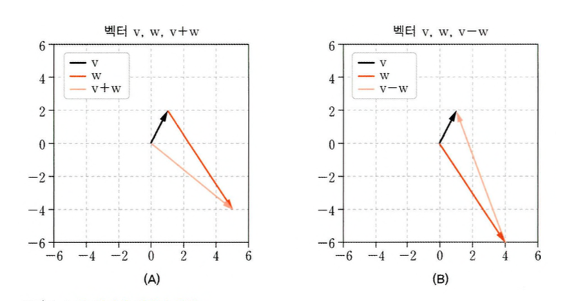

# 01 - 벡터와 벡터의 기본 연산

## 벡터 연산

### 1️⃣ 두 벡터의 덧셈

파이썬에서 두 벡터를 더하는 방법

```python
v = np.array([4,5,6])
w = np.array([10,20,30])
u = np.array([0,3,6,9])
vPlusW = v + w
uPlusW = u + w # 차원 불일치
```

```python
v = np.array([[4,5,6]]) # 행벡터
w = np.array([[10,20,30]]).T # 열벡터
v + w
# >> array([[14, 15, 16],
#           [24, 25, 26],
#           [34, 35, 36]])
```

파이썬은 **브로드캐스팅**이라는 연산을 한다.

### 2️⃣ 벡터의 덧셈과 뺄셈의 기하학적 해석



### 3️⃣ 스칼라-벡터 곱셈

스칼라벡터 곱셈을 **_λw_** 로 나타낼 수 있음

```python
s = 2
a = [3,4,5] # 리스트
b = np.array（a） # np 배열
print（a*s）
print（b*s）

# [ 3, 4, 5, 3, 4, 5 ]
# [ 6 8 10 ]
```

만약 `s=2.0`으로 설정하면

`TypeError: can't multiply sequence by non-int of type 'float’`를 만나게 된다.

### 4️⃣ 스칼라-벡터 덧셈

벡터에 스칼라를 더하는 것은 선형대수학에서 불가능/. 벡터와 스칼라는 별도의 수학적 객체이기 때문.

하지만 파이썬과 같은 수치 처리 프로그램에서는 벡터에 스칼라를 더할 수 있으며 이 연산은 스칼라-벡터 곱셈과 유사

```python
s = 2
v = np.array（[3,6]）
s + v
# array（[5, 8]）
```

- 벡터는 원점을 통과해서 양방향의 무한대로 가는 무한히 긴 선을 가리킨다는 해석도 있음.

### 5️⃣ 전치

열벡터를 행벡터 혹은 반대로 변환

- 벡터를 두 번 전치하면 벡터는 원래 방향이 됩니다. 다시말해 vTT = v 입니다.
- 이는 당연해 보이지만 데이터 과학과 머신러닝 등 여러 중요한
  증명에서 핵심 근거가 됩니다

### 6️⃣ 파이썬에서 벡터 브로드캐스팅

브로드캐스팅 연산은 현대 컴퓨터 기반 선형대수학에서만 존재

```python
v = np.array([[l,2,3]]).T # 열벡터
w = np.array([[10,20]]) # 행벡터
v + w # 브로드캐스팅 덧셈
# array([[11, 21],
#        [12, 22],
#        [13, 23]])
```

## 벡터 크기와 단위벡터

크기(기하학적 길이 또는 노름norm)는 벡터의 꼬리부터 머리까지의 거리이며 표준 유클리드Euchdean 거리 공식(벡터 원소들의 제곱합에 제곱근을 취함

- `np.norm()`은 기하학적 길이를 반환함.
- 길이가 1인 벡터를 단위벡터라고 한다.
- 벡터노름의 역수를 스칼라곱셈하면 단위벡터가 나온다.

## 벡터-내적

내적은 하나의 숫자로 두 벡터 사이의 관계를 나타낸다.

```bash
[1 2 3 4]- [5 678] = 1X5 + 2X6 + 3X7 + 4X8
= 5 + 12 + 21
= 70
```

파이썬 내적을 구현하는 방법중 하나는 `np.dot()`

```python
v = np.array([l,2,3,4])
w = np.array([5,6,7,8])
np.dot(v,w)
```

벡터에 스칼라를 곱하면 내적도 그만큼 커진다.

```python
S = 10
np.dot(s*v,w)
```

- 내적은 두 벡터 사이의 유사성 또는 매핑 mapping의 척도로 해석할 수 있다.
- 내적의 크기는 데이터의 단위에 따라 달라짐. 이러한 단위의 차이는 정규화 계수로 제거있다.
- 실제로 두 변수 사이의 정규화된 내적을 피어슨 상관계수라고한다.

### 1️⃣ 내적의 분배 법칙

```python
a = np.array([ 0,1,2 ])
b = np.array([ 3,5,8 ])
c = np.array([ 13,21,34 ])
# 내적 분배 법칙
res1 = np.dot( a, b+c )
res2 = np.dot( a,b ) + np.dot( a,c )
# res1,2는 동일한 결과를 가진다.
```

### 2️⃣ 내적의 기하학적 해석

두 벡터의 크기(노름)를 곱하고 두 벡터 사이의 각도에서 코사인값만큼 크기를 늘리는 것


- 직교벡터의 내적은 0이다.

## 그 외 벡터 곱셈

1. 아다마르곱
2. 외적: 열벡터와 행벡터를 이용해 행렬을 만듦
3. 교차곱과 삼중곱

## 직교벡터 분해

직교 투영법(orthogonal projection)


위 그림에서 두 벡터는 수직임으로,


따라서


- 최소제곱식, 통계학, 머신러닝 등의 많은 응용분야에서 기초가 된다.

### 직교 투영법을 이용한 직교 벡터의 분해


직교 투영법을 이용해 벡터를 분해하였다.
