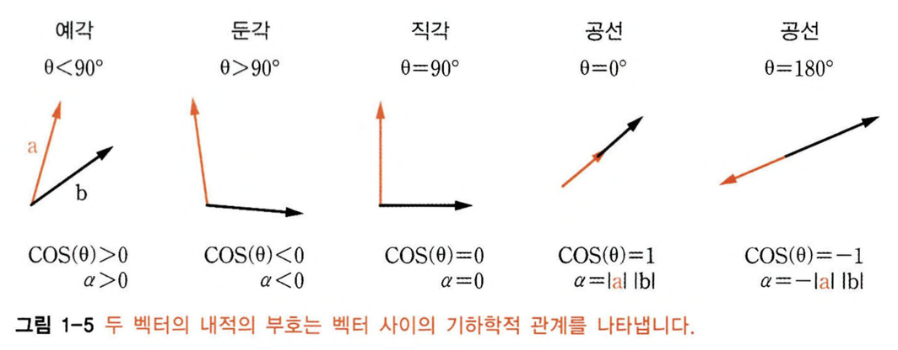

벡터: 수를 순서대로 나열한 것.

- 차원 : 벡터의 차원은 벡터가 가진 원소의 수(길이)
- 방향 : 열 방향인지 행 방향인지.

$$
R^N
$$

R은 실수, N은 차원

→ 방향과 차원이 모두 같아야 같은 벡터이다.

모든 벡터는 넘파이에서는 2차원 배열로 간주된다. 벡터가 가진 원소의 수(차원)과 상관없이.

전치연산: 열벡터를 행벡터로 변환한다.

보통 기본값은 열 방향이다.

파이썬에서 벡터는 리스트 타입으로 표현 가능하지만, 선형대수학에서 잘 동작하려면 NumPy배열로 생성하는게 좋다.

- 벡터를 생성하는 4가지 방법

방향은 대괄호로 지정한다. 가장 바깥쪽 대괄호는 모든 숫자를 하나의 객체로 묶는다. 내부 괄호는 행을 나타낸다.

```python
asList = [1,2,3]
asArray = np.array([1,2,3]) # 1차원 배열, 방향이 없음
rowVec = np.array([ [1,2,3] ]) # 행
colVec = np.array([ [1],[2],[3] ]) # 열
```

### 벡터의 연산

- 벡터의 덧셈, 뺄셈

동일한 차원과 방향을 갖는 벡터끼리만 가능

방향이 다르면, 파이썬에서는 브로드캐스팅 연산을 한다

- 덧셈과 뺄셈의 기하학적 해석
  덧셈 : 첫 벡터의 꼬리와 두번째 벡터의 머리를 이은 선
  뺄셈 : 두번째 벡터의 머리에서 첫번째 벡터의 머리로 가는 선


### 스칼라-벡터 곱셈의 기하학적 해석

스칼라 : 벡터에 대비하는 개념으로 크기만 있고 방향을 가지지 않는다.

즉, 방향을 변경하지 않는다.

하지만 음의 스칼라를 곱하면 벡터의 방향이 뒤집힌다. → 방향을 바꾼 것은 아니다. 여전히 동일한 무한한 선을 가리킨다.


- 벡터의 평균
  벡터 덧셈과 스칼라-벡터 곱셈을 이용한다.
  두 벡터의 평균 = 두 벡터를 덧셈, 스칼라 1/2 를 곱셈 (N개의 벡터는 모두 더하고 1/N 스칼라를 곱함)

### 전치 연산

행과 열의 인덱스를 맞바꾼다.

데이터 행렬에 자신의 전치를 곱하면 대칭 공분산 행렬이 만들어진다 (원래 방향이 됨)

### 벡터 크기와 단위 벡터

벡터의 크기 : 벡터의 꼬리부터 머리까지의 거리. 유클리드 거리 공식으로 구함


벡터의 길이 : len(v)

벡터의 크기(노름): np.linalg.norm(v)

### 벡터 - 내적 (dot-product)

동일한 차원의 두 벡터 사이에서만 성립

두 벡터 사이의 유사성 또는 매핑의 척도. 클 수록 상관

피어슨 상관계수 : 두 변수 사이의 정규화된 내적

내적은 분배법칙이 성립한다.


`np.dot(v, w)`

### 내적의 기하학적 해석

직교벡터의 내적은 0이다.



### 그 외 벡터 곱셈

- 아다마르곱

  원소별로 곱한다.

  곱의 결과는 두 벡터와 같은 차원의 벡터

  (아래 코드는 에러. 차원이 다르기 때문)

  

- 외적
  열벡터와 행벡터를 이용해 행렬을 만든다.
  외적은 스칼라 대신 행렬을 생성한다.
  두 벡터의 차원은 달라도 된다.
  외적 행렬의 각 행은 행벡터 스칼라에 대응하는 열벡터 원소를 곱한것.

### 직교벡터 분해

분해를 통해 행렬을 사용하기 쉬운 형태로 만들거나 압축, 숨겨진 정보

ex) 42.01 = 42, 0.1 , 42 = 2 _ 3 _ 7

- 투영 벡터
  하나는 기준 벡터와 직교, 하나는 기준 벡터와 평행
  
  투영 벡터를 찾는 공식
  
  직교 투영법 : 점을 최소 거리로 선에 투영하는 공식
- 목표 벡터를 두개의 벡터로 분해

  1. 두 벡터의 합은 목표벡터
  2. 하나의 벡터는 기준 벡터에 직교, 다른 하나는 기준 벡터와 평행

     
