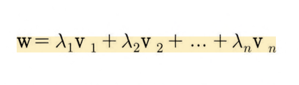

# 벡터, 파트 2: 벡터의 확장 개념

## 1️⃣ 벡터 집합

- 벡터들의 모음을 집합이라고 한다.
- 벡터 부분공간이 무한한 벡터 집합이고 이는 통계 모델을 데이터에 적합시킬 때 큰 영향을 미친다.

## 2️⃣ 선형 가중 결합

- 여러 변수마다 가중치를 다르게 주어 정보를 혼합하는 방법
- **선형 혼합**, 또는 **가중 결합**이라고 한다.
- 단순히 말하면 스칼라-벡터 곱셉을 한 다음 합하는 것



벡터 타입이 Numpy배열이 아닌 벡터리스트라면 다음과 같이 실행된다.

```python
import numpy as np

l1 = 1
l2 = 2
l3 = -3
v1 = np.array([4,5,1])
v2 = np.array([-4,0,-4])
v3 = np.array([1,3,2])
print(l1*v1 + l2*v2 + l3*v3)

# >> [ -7  -4 -13]
# >> numpy 배열이 아닐경우, [4, 5, 1, -4, 0, -4, -4, 0, -4]
# 일반 배열에 음수를 곱하면 빈배열이 나타남.
```

- 선형 가중 결합은 여러 방면에서 응용된다.
  - 통계 모델로부터 예측된 데이터는 최소제곱 알고리즘을 통해 계산되는 회귀변
    수regressor(독립변수)와 계수(스칼라)의 선형 가중 결합으로 생성됨
  - 주성분 분석과 같은 차원 축소 과정에서 각 성분은 성분의 분산을 최대화하는 가중치(계수)와 데이터 채널의 선형 가중 결합으로 도출됨

## 3️⃣ 선형 독립성

- 벡터 집합에서 적어도 하나의 벡터를 집합의 다른 벡터들의 선형 가중 결합으로 나타낼
  수 있을 때 벡터 집합을 선형 종속적이라고 한다.
- 아무런 벡터도 나타낼 수 없다면 해당 벡터 집합은 선형 독립적
- 벡터 집합으로 행렬을 만들고 행렬의 계수를 계산한 다음 행의 수와 열의 수 중에서 더 작은 값과 비교하는 것
  → 그 행렬의 계수(rank)를 계산한고, 계수가 벡터 개수와 같으면 선형 독립, 작으면 선형 종속이다.

### 수학에서의 선형 독립성


- 선형 종속적이라면 집합의 벡터들의 선형 가중 결합으로 영벡터를 만들수 있다는 것
- 식을 0과 같다고 설정하면 전체 집합이 종속적 또는 독립적이라는 원리를 강조할 수 있음
- 대부분 적어도 하나의 A≠0이라는 제약 조건을 단다.


- 영벡터가 포함된 모든 벡터 집합은 당연히 선형 종속적인 집합

## 4️⃣ 부분공간과 생성

- 다른 가중치 숫자를 사용해서 무한히 선형 결합하는 방식으로 벡터 부분공간을 만든다.
- 가능한 모든 선형 가중 결합을 구성하는 메커니즘을 벡터 집합의 생성이라고 한다.


- 벡터 집합에서 생성되는 부분공간의 차원은 선형 독립 집합을 형성하는 데 필요한 최소
  한의 벡터 수이다.

## 5️⃣ 기저

- 기저는 행렬의 정보（예, 데이터）를 설명하는 데 사용하는 자의 집합
- 데카르트 기저 집합은 서로 직교하며 단위 길이인 벡터
  
- 하지만 다음 기저 집합을 선호한다.
  
  - `p=(3,1) q=(-6,2)`를 표현해보자
  - S로는 p는 `3s1 + 1s2` 결합이고 점 q는 `-6s1 + 2s2` 이다.
  - T로는 p는 `1t1 + 0t2` q는 `0t1 + 2t2` 이다.
  - T는 간결하고 직관적이다.
    
  - ICA로 계산된 기저 벡터가 가장 좋다고 말할수도 있겠지만, 어떤 기저 집합이 최적인지를 찾는 것은 실제로 굉장히 어렵다.
    

### 기저 정의

- 단순히 생성과 독립성을 결합한 것
  1. 특정 부분공간을 생성하고,
  2. 독립적인 벡터 집합인 것


- 기저 집합은 선형 독립이어야 하는 이유는 부분공간에 있는 모든 벡터는 그 기저를 이용한 고유한 좌표를 가져야 하기 때문이다.
